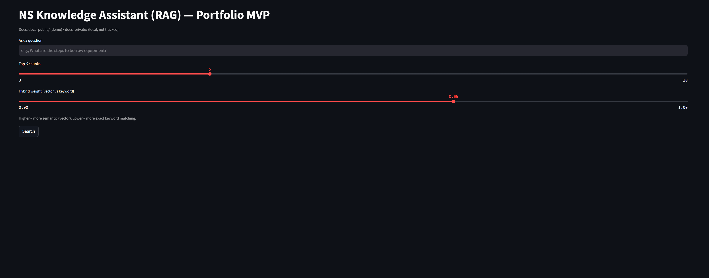
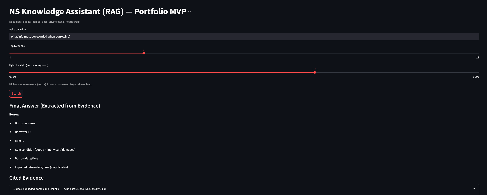
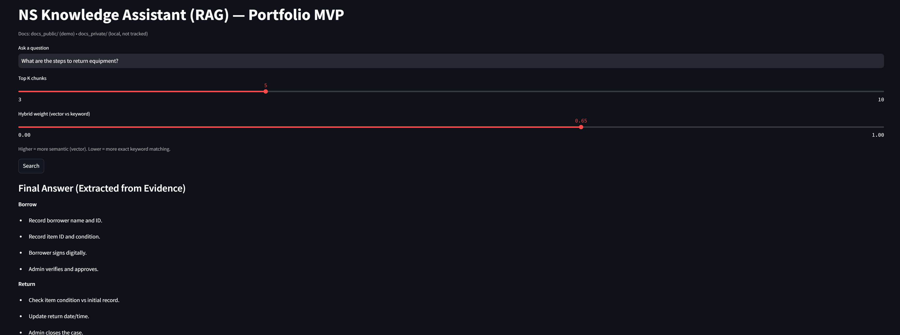
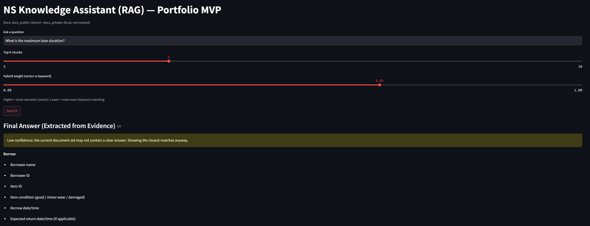

# RAG Knowledge Assistant (Streamlit + FAISS)

I built this as a simple RAG-style “knowledge search” tool: you put documents into a folder, ask questions, and it returns the most relevant excerpts with citations (source + chunk id).  
Goal is to keep it lightweight first, then improve it later.

## What it can do
- Read Markdown / TXT / PDF documents
- Split documents into overlapping chunks (so context won’t break)
- Convert chunks into embeddings (SentenceTransformers)
- Store embeddings in a FAISS index for fast semantic search
- Streamlit UI to query and show top-k cited evidence
- Show a **Final Answer** extracted from top evidence (no hallucination)
- Warn on **low-confidence retrieval**
- **Hybrid retrieval** (vector + keyword) for more robust search across different query styles

## Tech used
- Python
- Streamlit
- SentenceTransformers (`all-MiniLM-L6-v2`)
- FAISS (vector search)
- PyPDF (PDF reader)

## Included sample docs
- SOP sample (borrow/return flow)
- FAQ sample (common questions + what to record)
- Checklist sample (admin steps + incident handling)

## How it works (high level)
1. Load docs from `docs_public/`
2. Chunk text with overlap
3. Embed each chunk into vectors
4. Save vectors into FAISS
5. For a query: embed query → hybrid retrieval → display evidence with citations

## Run locally (Windows)
```bash
python -m venv .venv
.\.venv\Scripts\activate
pip install -r requirements.txt

python ingest.py
streamlit run app.py

## Screenshots (demo)
### UI + Hybrid Controls


### Example 1: FAQ retrieval (what to record)


### Example 2: SOP retrieval (borrow/return steps)


### Low-confidence warning (question not in docs)
